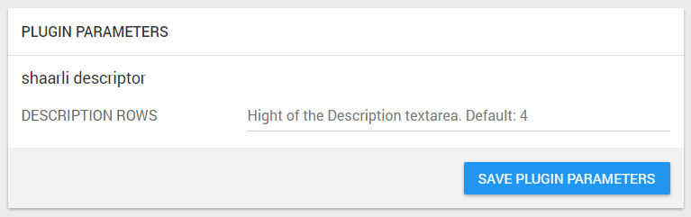
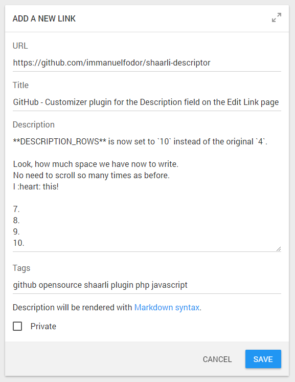

# Shaarli Descriptor Plugin

Customizer plugin for the **Description** field on the **Edit Link** page for any [Shaarli](https://github.com/shaarli/Shaarli) instance.

Tested on Shaarli 0.9.2 with the [Shaarli-Material](https://github.com/kalvn/Shaarli-Material) theme.

## Features

* Set up the number of rows that define the hight of the Description textarea.
    * Should be an integer number greater than or equal to `1`
    * If not specified or malformed, defaults to `4`
* Plugin Administration page integration for easy configuration

## Screenshots

### Plugin Administration page

After plugin enabled with default `DESCRIPTION_ROWS` settings:



### Edit Link page

After plugin enabled and `DESCRIPTION_ROWS` set to 10:




## Installation

The plugin's folder (`shaarli_descriptor`) should be placed in the `tpl/plugins/` directory. If not, download and unpack it there.

The directory structure should look like:

```bash
└── plugins
    └── shaarli_descriptor
        ├── shaarli_descriptor.html
        ├── shaarli_descriptor.meta
        └── shaarli_descriptor.php
```

To enable the plugin, just check it in the Plugin Administration page (`?do=pluginadmin`).

You can also add `shaarli_descriptor` to your list of enabled plugins in `data/config.json.php`
(`general.enabled_plugins` list).

This should look like:

```
"general": {
  "enabled_plugins": [
    "shaarli_descriptor",
    [...]
  ],
}
```

## Configuration

Go to the Plugin Administration page, and edit the following settings (with the plugin enabled).

* **DESCRIPTION_ROWS**: *Hight of the Description textarea. Default: 4*\
Example value: `8`

> Note: this setting can also be set in `data/config.json.php`, in the plugins section.

## Known issues

None

## Contact

Immánuel Fodor | [fodor.it](https://fodor.it)